# 🏗️ Money Flow - Technical Architecture

## 📋 **Overview**

Money Flow is a production-ready, cloud-native web application that demonstrates modern software development practices. It processes Georgian government budget data through an automated pipeline and provides interactive analytics via web interfaces. Built on Google Cloud Platform (GCP) with full Infrastructure as Code (Terraform) and CI/CD automation.

## 🎯 **Architecture Principles**

- **🚀 Serverless-First**: Scale-to-zero compute with Cloud Functions and Cloud Run
- **🏗️ Infrastructure as Code**: Complete Terraform modules with environment separation
- **🔄 CI/CD Automation**: Automated builds, tests, and deployments via Cloud Build
- **🔒 Security by Design**: Private VPC networking, IAM roles, and Secret Manager
- **💰 Cost-Optimized**: Pay-per-use serverless architecture with efficient resource usage
- **📊 Observability**: Comprehensive monitoring, logging, and health checks
- **🧪 Testing**: Unit tests, integration tests, and automated quality checks

## 🌐 **High-Level Architecture**

Modern three-tier serverless architecture:

1. **📊 Data Layer**: Cloud Storage + Cloud SQL + Cloud Functions (data pipeline)
2. **⚙️ Application Layer**: Cloud Run (FastAPI backend + Flask frontend)
3. **🌍 Infrastructure Layer**: Load Balancer + VPC + Secret Manager + CI/CD
4. **📈 Monitoring Layer**: Cloud Monitoring + Logging + Health Checks

## 🔄 **Data Flow Diagram**


## 🏛️ **Component Architecture**

### **Phase 1: Data Pipeline (Automated)**


### **Phase 2: Application Deployment**


## 🛠️ **Technology Stack**

### **📊 Data Processing Pipeline**
- **Language**: Python 3.11
- **Framework**: `datapackage-pipelines` for data transformation
- **Runtime**: Cloud Functions (2nd generation)
- **Scheduling**: Cloud Scheduler (quarterly cron jobs)
- **Event Handling**: Pub/Sub for trigger messages
- **Storage**: Cloud Storage (regional, lifecycle policies)

### **🔧 Backend API**
- **Framework**: FastAPI with Pydantic models
- **Runtime**: Cloud Run (serverless, auto-scaling)
- **Database**: Cloud SQL PostgreSQL (drill-down analytics)
- **Data Source**: Cloud Storage (budget CSV/JSON files)
- **Authentication**: GCP Service Accounts
- **Documentation**: Auto-generated OpenAPI/Swagger

### **🌐 Frontend Application**
- **Framework**: Flask with Jinja2 templates
- **Runtime**: Cloud Run (serverless)
- **UI**: Responsive HTML/CSS/JavaScript
- **API Communication**: RESTful HTTP requests
- **Styling**: Modern CSS with mobile support

### **🏗️ Infrastructure & DevOps**
- **Infrastructure as Code**: Terraform with modular design
- **Container Registry**: Artifact Registry
- **Load Balancing**: Global HTTP(S) Load Balancer + Cloud CDN
- **SSL/TLS**: Google-managed SSL certificates
- **CI/CD**: Cloud Build with automated triggers
- **Development**: Docker Compose for local environment

### **🔒 Security & Monitoring**
- **Secrets Management**: Google Secret Manager
- **Networking**: Private VPC with VPC connector
- **IAM**: Service accounts with least-privilege access
- **Monitoring**: Cloud Monitoring + Cloud Logging
- **Health Checks**: Automated uptime monitoring
- **Cost Management**: Budget alerts and optimization

## 🔐 **Security Architecture**

```mermaid
graph LR
    subgraph "Public Internet"
        Internet[🌐 Internet]
    end

    subgraph "GCP Project"
        subgraph "Public Layer"
            LB[⚖️ Load Balancer<br/>HTTPS Only]
            Frontend[🌐 Frontend<br/>Public Access]
        end

        subgraph "Private VPC"
            Backend[🔧 Backend API<br/>Internal Only]
            CloudSQL[🐘 Cloud SQL<br/>Private IP]
            VPCConnector[🔗 VPC Connector]
        end

        subgraph "Secrets & IAM"
            SecretManager[🔐 Secret Manager]
            ServiceAccounts[👤 Service Accounts]
        end
    end

    Internet --> LB
    LB --> Frontend
    LB --> Backend
    Backend --> VPCConnector
    VPCConnector --> CloudSQL
    Backend --> SecretManager
    Frontend --> ServiceAccounts
    Backend --> ServiceAccounts

    classDef public fill:#ffcdd2
    classDef private fill:#c8e6c9
    classDef security fill:#fff9c4

    class Internet,LB,Frontend public
    class Backend,CloudSQL,VPCConnector private
    class SecretManager,ServiceAccounts security
```



## 📊 **Data Architecture**

### **Storage Strategy**
```
Cloud Storage Structure:
📁 georgian-budget-data-bucket/
├── 📁 raw/
│   ├── georgian-budget-2024-12-15.xlsx
│   ├── georgian-budget-2024-09-15.xlsx
│   └── ...
├── 📁 processed/
│   ├── georgian_budget.csv      (Latest processed data)
│   ├── georgian_budget.json     (API-friendly format)
│   └── datapackage.json         (Metadata)
└── 📁 archives/
    └── historical versions...
```

### **Database Schema**
```sql
-- Cloud SQL PostgreSQL Schema
CREATE SCHEMA budget_analytics;

-- Main departments
CREATE TABLE departments (
    id SERIAL PRIMARY KEY,
    name_english VARCHAR(255) UNIQUE NOT NULL,
    name_georgian VARCHAR(255),
    description TEXT
);

-- Sub-departments for drill-down analysis
CREATE TABLE sub_departments (
    id SERIAL PRIMARY KEY,
    department_id INTEGER REFERENCES departments(id),
    name_english VARCHAR(255) NOT NULL,
    name_georgian VARCHAR(255),
    allocation_percentage DECIMAL(5,2) NOT NULL,
    employee_count INTEGER DEFAULT 0,
    projects_count INTEGER DEFAULT 0
);

-- Budget allocations by year
CREATE TABLE sub_department_budgets (
    id SERIAL PRIMARY KEY,
    sub_department_id INTEGER REFERENCES sub_departments(id),
    year INTEGER NOT NULL,
    budget_amount DECIMAL(15,2) NOT NULL,
    notes TEXT,
    UNIQUE(sub_department_id, year)
);
```

## 🚀 **Deployment Architecture**

### **Infrastructure Deployment (Terraform)**

```mermaid
graph TB
    subgraph "Terraform State"
        TerraformState["📋 Terraform State<br/>Infrastructure Definition"]
    end

    subgraph "GCP Resources"
        VPC["🔒 VPC Network"]
        CloudSQL["🐘 Cloud SQL"]
        ServiceAccounts["👤 Service Accounts"]
        LoadBalancer["⚖️ Load Balancer"]
        ArtifactRegistry["📦 Artifact Registry"]
        SecretManager["🔐 Secret Manager"]
        CloudBuild["🔨 Cloud Build Triggers"]
    end

    TerraformState --> VPC
    TerraformState --> CloudSQL
    TerraformState --> ServiceAccounts
    TerraformState --> LoadBalancer
    TerraformState --> ArtifactRegistry
    TerraformState --> SecretManager
    TerraformState --> CloudBuild

    classDef terraform fill:#623ce4,color:#fff
    classDef infrastructure fill:#4285f4,color:#fff

    class TerraformState terraform
    class VPC,CloudSQL,ServiceAccounts,LoadBalancer,ArtifactRegistry,SecretManager,CloudBuild infrastructure
```


### **Application Deployment (Cloud Build)**

```mermaid
graph LR
    subgraph "Source Code"
        API["📁 moneyflow-back/<br/>FastAPI Code"]
        WebApp["📁 moneyflow-front/<br/>Flask Code"]
    end

    subgraph "Cloud Build"
        BuildAPI["🔨 Build API<br/>Docker Image"]
        BuildWeb["🔨 Build Web<br/>Docker Image"]
    end

    subgraph "Deployment"
        CloudRunAPI["☁️ Cloud Run<br/>Backend API"]
        CloudRunWeb["☁️ Cloud Run<br/>Frontend Web"]
    end

    API --> BuildAPI
    WebApp --> BuildWeb
    BuildAPI --> CloudRunAPI
    BuildWeb --> CloudRunWeb

    classDef source fill:#34a853
    classDef build fill:#fbbc04
    classDef deploy fill:#ea4335

    class API,WebApp source
    class BuildAPI,BuildWeb build
    class CloudRunAPI,CloudRunWeb deploy
```


## 📈 **Scalability & Performance**

### **Auto-Scaling Configuration**
- **Cloud Functions**: 0-1 instances, 9-minute timeout
- **Cloud Run**: 0-10 instances per service
- **Cloud SQL**: db-f1-micro with auto-scaling storage
- **Load Balancer**: Global with CDN caching

### **Performance Optimizations**
- **CDN Caching**: Static assets cached globally
- **Database Indexing**: Optimized queries for budget analysis
- **Connection Pooling**: Efficient database connections
- **Compression**: Gzip compression for API responses

## 💰 **Cost Optimization**

### **Monthly Cost Breakdown**
```
Phase 1 (Data Pipeline): $6-20/month
├── Cloud Functions: $2-5
├── Cloud Storage: $1-3
├── Cloud Scheduler: $0.10
└── Pub/Sub: $0.50

Phase 2 (Applications): $63-128/month
├── Cloud Run: $10-30
├── Cloud SQL: $25-50
├── Load Balancer: $18
├── Cloud Build: $5-15
└── Network: $5-15

Total: $69-148/month
```

### **Cost Optimization Features**
- Scale-to-zero for compute resources
- Efficient storage lifecycle policies
- Shared load balancer across services
- Minimal database instance sizing

## 🔄 **Operational Workflows**

### **Data Update Workflow**
1. **Quarterly Trigger**: Cloud Scheduler activates pipeline
2. **Data Fetch**: Cloud Function downloads from geostat.ge
3. **Processing**: datapackage-pipelines transforms data
4. **Storage**: Results saved to Cloud Storage
5. **API Refresh**: Backend automatically serves new data

### **Application Update Workflow**
1. **Code Push**: Developer commits to GitHub
2. **Build Trigger**: Cloud Build starts automatically
3. **Image Build**: Docker images created and pushed
4. **Deployment**: Cloud Run services updated
5. **Load Balancer**: Traffic routed to new versions

### **Monitoring & Alerting**
- Health checks on all services
- Performance monitoring via Cloud Monitoring
- Error tracking and logging
- Budget alerts for cost management

## 🔧 **Local Development Architecture**

### **Docker Compose Setup**
```yaml
# Development services configuration
services:
  postgres:        # PostgreSQL database with test data
    image: postgres:15
    ports: 5432:5432
    volumes: fixtures/init (SQL scripts)

  api:             # FastAPI backend
    build: moneyflow-back/
    ports: 8000:8000
    depends_on: postgres
    environment: DATABASE_URL, CLOUD_STORAGE_BUCKET

  frontend:        # Flask frontend
    build: moneyflow-front/
    ports: 5000:5000
    depends_on: api
    environment: API_BASE_URL=http://api:8000
```

### **Development Workflow**
1. **Local Setup**: `make setup` - installs dependencies and starts database
2. **Service Start**: `make start` - starts all services via Docker Compose
3. **Development**: Hot reload enabled for both frontend and backend
4. **Testing**: `make test` - runs unit and integration tests
5. **Quality**: `make lint` and `make format` for code quality

### **Data Flow in Development**
- **Backend**: Connects to local PostgreSQL + GCP Cloud Storage
- **Frontend**: Connects to local backend API
- **Database**: Initialized with fixtures/init SQL scripts
- **Cloud Storage**: Uses service account for GCP authentication

## 🚀 **Production vs Development**

| Aspect | Development (Local) | Production (GCP) |
|--------|-------------------|------------------|
| **Backend Runtime** | Docker container | Cloud Run |
| **Frontend Runtime** | Docker container | Cloud Run |
| **Database** | Local PostgreSQL | Cloud SQL |
| **Data Storage** | GCP Cloud Storage | GCP Cloud Storage |
| **Load Balancer** | Direct ports | Global Load Balancer |
| **SSL/HTTPS** | HTTP only | HTTPS with SSL certificates |
| **Monitoring** | Basic logs | Cloud Monitoring + Logging |
| **Scaling** | Manual | Auto-scaling (0 to N instances) |

## 🎯 **Key Architectural Decisions**

### **Why Serverless?**
- **Cost Efficiency**: Pay only for actual usage
- **Auto-scaling**: Handles traffic spikes automatically
- **Maintenance**: Minimal server management overhead
- **Reliability**: Built-in high availability

### **Why Terraform Modules?**
- **Reusability**: Same modules for staging/production
- **Maintainability**: Clear separation of concerns
- **Version Control**: Infrastructure changes tracked in Git
- **Collaboration**: Team-friendly infrastructure management

### **Why FastAPI + Flask?**
- **FastAPI**: Best-in-class API performance with automatic docs
- **Flask**: Simple, lightweight frontend perfect for this use case
- **Python**: Single language across the entire stack
- **Ecosystem**: Rich libraries for data processing

### **Why PostgreSQL + Cloud Storage?**
- **PostgreSQL**: ACID compliance for drill-down analytics
- **Cloud Storage**: Cost-effective for large budget data files
- **Hybrid Approach**: Best of both structured and unstructured data

---

**🏗️ This architecture demonstrates production-ready software engineering practices with modern cloud-native technologies, showcasing skills in full-stack development, infrastructure automation, and DevOps best practices.**
