# 🏗️ Georgian Budget Application Architecture

## 📋 **Overview**

The Georgian Budget application is a cloud-native data platform built on Google Cloud Platform (GCP) that automatically processes Georgian government budget data and provides interactive analytics through web interfaces.

## 🎯 **Architecture Principles**

- **Serverless-First**: Scale-to-zero compute with Cloud Functions and Cloud Run
- **Infrastructure as Code**: Complete Terraform-managed infrastructure
- **CI/CD Automation**: Automated builds and deployments via Cloud Build
- **Security by Design**: Private networking, IAM, and Secret Manager
- **Cost-Optimized**: Pay-per-use with automatic scaling

## 🌐 **High-Level Architecture**

The system follows a modern three-tier architecture with data pipeline automation:

1. **Data Layer**: Cloud Storage + Cloud SQL
2. **Processing Layer**: Cloud Functions + Cloud Run
3. **Presentation Layer**: Load Balancer + Web Frontend
4. **Automation Layer**: Cloud Build + Cloud Scheduler

## 🔄 **Data Flow Diagram**


## 🏛️ **Component Architecture**

### **Phase 1: Data Pipeline (Automated)**


### **Phase 2: Application Deployment**


## 🛠️ **Technology Stack**

### **Data Processing**
- **Language**: Python 3.11
- **Pipeline**: datapackage-pipelines
- **Runtime**: Cloud Functions (2nd gen)
- **Triggers**: Cloud Scheduler + Pub/Sub
- **Storage**: Cloud Storage (regional)

### **Backend API**
- **Framework**: FastAPI
- **Runtime**: Cloud Run (serverless)
- **Database**: Cloud SQL PostgreSQL
- **Authentication**: Service Account
- **Storage**: Cloud Storage integration

### **Frontend Application**
- **Framework**: Flask
- **Runtime**: Cloud Run (serverless)
- **UI**: Responsive HTML/CSS/JavaScript
- **API**: RESTful communication

### **Infrastructure**
- **IaC**: Terraform
- **Container Registry**: Artifact Registry
- **Load Balancing**: Global HTTP(S) Load Balancer
- **SSL/TLS**: Google-managed certificates
- **CDN**: Cloud CDN integration

### **DevOps & Security**
- **CI/CD**: Cloud Build
- **Secrets**: Secret Manager
- **Networking**: Private VPC
- **IAM**: Service accounts with least privilege
- **Monitoring**: Cloud Monitoring & Logging

## 🔐 **Security Architecture**

```mermaid
graph LR
    subgraph "Public Internet"
        Internet[🌐 Internet]
    end

    subgraph "GCP Project"
        subgraph "Public Layer"
            LB[⚖️ Load Balancer<br/>HTTPS Only]
            Frontend[🌐 Frontend<br/>Public Access]
        end

        subgraph "Private VPC"
            Backend[🔧 Backend API<br/>Internal Only]
            CloudSQL[🐘 Cloud SQL<br/>Private IP]
            VPCConnector[🔗 VPC Connector]
        end

        subgraph "Secrets & IAM"
            SecretManager[🔐 Secret Manager]
            ServiceAccounts[👤 Service Accounts]
        end
    end

    Internet --> LB
    LB --> Frontend
    LB --> Backend
    Backend --> VPCConnector
    VPCConnector --> CloudSQL
    Backend --> SecretManager
    Frontend --> ServiceAccounts
    Backend --> ServiceAccounts

    classDef public fill:#ffcdd2
    classDef private fill:#c8e6c9
    classDef security fill:#fff9c4

    class Internet,LB,Frontend public
    class Backend,CloudSQL,VPCConnector private
    class SecretManager,ServiceAccounts security
```



## 📊 **Data Architecture**

### **Storage Strategy**
```
Cloud Storage Structure:
📁 georgian-budget-data-bucket/
├── 📁 raw/
│   ├── georgian-budget-2024-12-15.xlsx
│   ├── georgian-budget-2024-09-15.xlsx
│   └── ...
├── 📁 processed/
│   ├── georgian_budget.csv      (Latest processed data)
│   ├── georgian_budget.json     (API-friendly format)
│   └── datapackage.json         (Metadata)
└── 📁 archives/
    └── historical versions...
```

### **Database Schema**
```sql
-- Cloud SQL PostgreSQL Schema
CREATE SCHEMA budget_analytics;

-- Main departments
CREATE TABLE departments (
    id SERIAL PRIMARY KEY,
    name_english VARCHAR(255) UNIQUE NOT NULL,
    name_georgian VARCHAR(255),
    description TEXT
);

-- Sub-departments for drill-down analysis
CREATE TABLE sub_departments (
    id SERIAL PRIMARY KEY,
    department_id INTEGER REFERENCES departments(id),
    name_english VARCHAR(255) NOT NULL,
    name_georgian VARCHAR(255),
    allocation_percentage DECIMAL(5,2) NOT NULL,
    employee_count INTEGER DEFAULT 0,
    projects_count INTEGER DEFAULT 0
);

-- Budget allocations by year
CREATE TABLE sub_department_budgets (
    id SERIAL PRIMARY KEY,
    sub_department_id INTEGER REFERENCES sub_departments(id),
    year INTEGER NOT NULL,
    budget_amount DECIMAL(15,2) NOT NULL,
    notes TEXT,
    UNIQUE(sub_department_id, year)
);
```

## 🚀 **Deployment Architecture**

### **Infrastructure Deployment (Terraform)**

```mermaid
graph TB
    subgraph "Terraform State"
        TerraformState["📋 Terraform State<br/>Infrastructure Definition"]
    end

    subgraph "GCP Resources"
        VPC["🔒 VPC Network"]
        CloudSQL["🐘 Cloud SQL"]
        ServiceAccounts["👤 Service Accounts"]
        LoadBalancer["⚖️ Load Balancer"]
        ArtifactRegistry["📦 Artifact Registry"]
        SecretManager["🔐 Secret Manager"]
        CloudBuild["🔨 Cloud Build Triggers"]
    end

    TerraformState --> VPC
    TerraformState --> CloudSQL
    TerraformState --> ServiceAccounts
    TerraformState --> LoadBalancer
    TerraformState --> ArtifactRegistry
    TerraformState --> SecretManager
    TerraformState --> CloudBuild

    classDef terraform fill:#623ce4,color:#fff
    classDef infrastructure fill:#4285f4,color:#fff

    class TerraformState terraform
    class VPC,CloudSQL,ServiceAccounts,LoadBalancer,ArtifactRegistry,SecretManager,CloudBuild infrastructure
```


### **Application Deployment (Cloud Build)**

```mermaid
graph LR
    subgraph "Source Code"
        API["📁 moneyflow-back/<br/>FastAPI Code"]
        WebApp["📁 web-app/<br/>Flask Code"]
    end

    subgraph "Cloud Build"
        BuildAPI["🔨 Build API<br/>Docker Image"]
        BuildWeb["🔨 Build Web<br/>Docker Image"]
    end

    subgraph "Deployment"
        CloudRunAPI["☁️ Cloud Run<br/>Backend API"]
        CloudRunWeb["☁️ Cloud Run<br/>Frontend Web"]
    end

    API --> BuildAPI
    WebApp --> BuildWeb
    BuildAPI --> CloudRunAPI
    BuildWeb --> CloudRunWeb

    classDef source fill:#34a853
    classDef build fill:#fbbc04
    classDef deploy fill:#ea4335

    class API,WebApp source
    class BuildAPI,BuildWeb build
    class CloudRunAPI,CloudRunWeb deploy
```


## 📈 **Scalability & Performance**

### **Auto-Scaling Configuration**
- **Cloud Functions**: 0-1 instances, 9-minute timeout
- **Cloud Run**: 0-10 instances per service
- **Cloud SQL**: db-f1-micro with auto-scaling storage
- **Load Balancer**: Global with CDN caching

### **Performance Optimizations**
- **CDN Caching**: Static assets cached globally
- **Database Indexing**: Optimized queries for budget analysis
- **Connection Pooling**: Efficient database connections
- **Compression**: Gzip compression for API responses

## 💰 **Cost Optimization**

### **Monthly Cost Breakdown**
```
Phase 1 (Data Pipeline): $6-20/month
├── Cloud Functions: $2-5
├── Cloud Storage: $1-3
├── Cloud Scheduler: $0.10
└── Pub/Sub: $0.50

Phase 2 (Applications): $63-128/month
├── Cloud Run: $10-30
├── Cloud SQL: $25-50
├── Load Balancer: $18
├── Cloud Build: $5-15
└── Network: $5-15

Total: $69-148/month
```

### **Cost Optimization Features**
- Scale-to-zero for compute resources
- Efficient storage lifecycle policies
- Shared load balancer across services
- Minimal database instance sizing

## 🔄 **Operational Workflows**

### **Data Update Workflow**
1. **Quarterly Trigger**: Cloud Scheduler activates pipeline
2. **Data Fetch**: Cloud Function downloads from geostat.ge
3. **Processing**: datapackage-pipelines transforms data
4. **Storage**: Results saved to Cloud Storage
5. **API Refresh**: Backend automatically serves new data

### **Application Update Workflow**
1. **Code Push**: Developer commits to GitHub
2. **Build Trigger**: Cloud Build starts automatically
3. **Image Build**: Docker images created and pushed
4. **Deployment**: Cloud Run services updated
5. **Load Balancer**: Traffic routed to new versions

### **Monitoring & Alerting**
- Health checks on all services
- Performance monitoring via Cloud Monitoring
- Error tracking and logging
- Budget alerts for cost management

## 🎯 **Future Roadmap**

### **Phase 3: Advanced Features**
- Real-time budget tracking
- Advanced analytics dashboard
- Multi-language support
- Mobile application
- API rate limiting
- Advanced caching strategies

### **Potential Enhancements**
- BigQuery integration for large-scale analytics
- Machine learning for budget predictions
- Integration with other government data sources
- Advanced visualization capabilities

---

**🏗️ This architecture provides a robust, scalable, and cost-effective platform for Georgian budget data analysis with modern cloud-native practices.**
